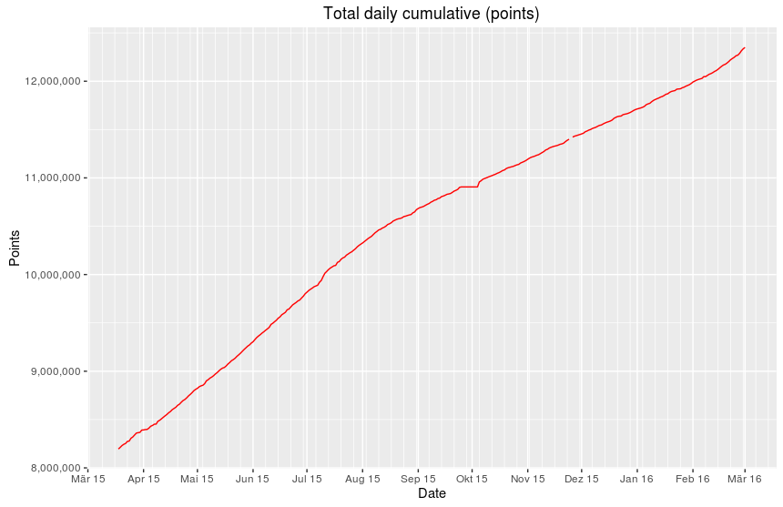
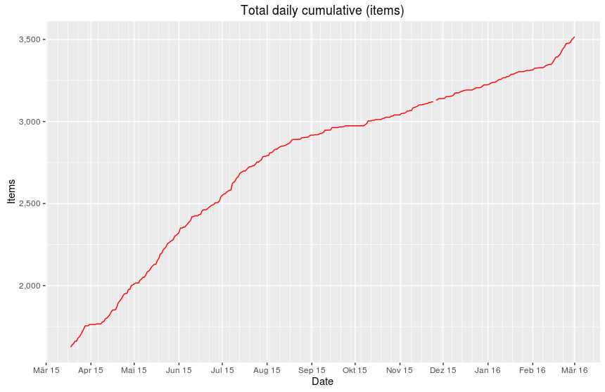
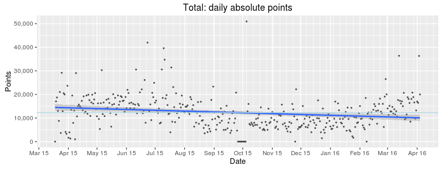
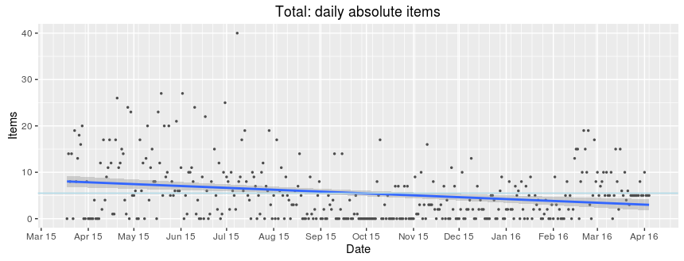
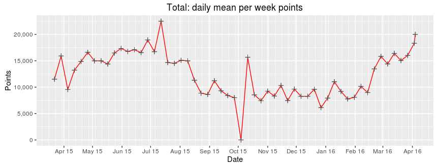
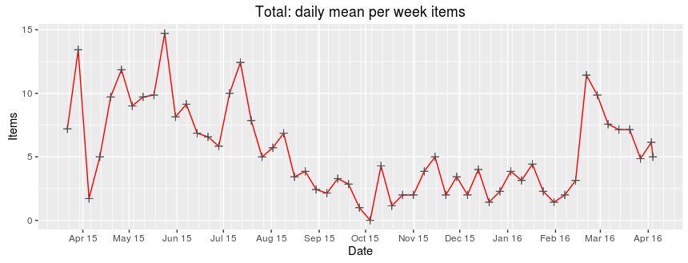
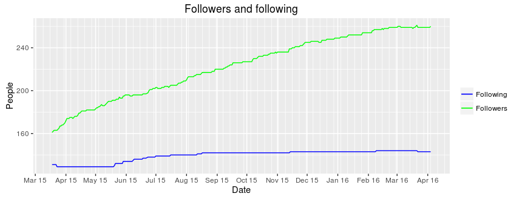

# memstats

A collection of R scripts that analyze and plot my recorded learning progress and performance with [Memrise](http://www.memrise.com). The learning data is retrieved once a day via the [unofficial API](https://github.com/carpiediem/memrise-enhancement-suite/wiki/Unofficial-Documentation-for-the-Memrise-API) and stored in a MySQL database. From this data, a CSV file is generated that is used as input for the script. 

##About

Since March 2015, I keep record of my Memrise learning performance (this is my [Memrise profile](http://www.memrise.com/user/mucx)). I figured out that getting more diverse stats about my learning process than the ones available on the profile page boosts my learning motivation. I can aim for new goals regularly, like increasing a specific mean value. For example, keeping the overall mean of points per day at a certain value.

A cron-job controlled PHP script obtains the raw learning data from the API and stores it into a MySQL database (__Note:__ The PHP script is not part of the repository). Using the quick export function of _phpMyAdmin_, a CSV file is created containing the following data:

* DATE:         Date of the data retrieval
* POINTS_TOTAL: Cumulative sum of all points
* POINTS_DAY:   No longer available via the API (as of 2015-12-15)
* POINTS_MONTH: Cumulative sum of points per month
* POINTS_WEEK:  Cumulative sum of points per week
* ITEMS:        Cumulative count of learned items
* FOLLOWERS:    Number of followers
* FOLLOWING:    Number of people I follow

The statistic values of the cumulative/absolute sums and means are computed for the entire dataset and each period subset (year, month, week) when the script is executed. Various graphs visualize the data and summaries are stored in CSV files. The total number of plots is as follows:

* 33 on the total data
* 23 per year
* 9 per month
* 5 per week

If you want me to keep track of your Memrise learning progress as well, just contact me!

##TO DOs

* Adding cumulative means evaluation from stats that are currently stored as CSV (for trend analysis)

##Ideas

* Enabling direct access to a MySQL database (would require no CSV file)
* Alternatively: storing the API data not in a database but directly in a CSV file (less workaround)
* Based on a CSV storage: Adding a simple D3.js version for a direct visualization in the browser  
  Example: http://bl.ocks.org/d3noob/b3ff6ae1c120eea654b5

##Examples

Here are some example plots created for my profile which visualize my overall learning process:

###Cumulative overall results

###Overall results (per day)

###Daily means per week

###Number of total followers/-ing

* * *
License: GNU GENERAL PUBLIC LICENSE