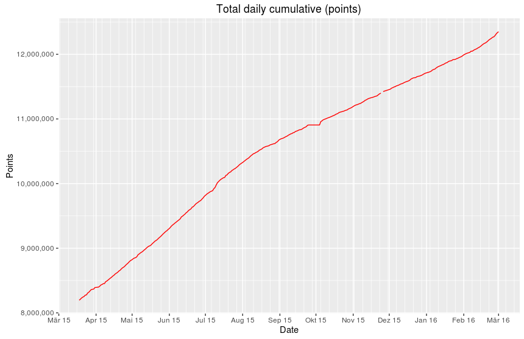
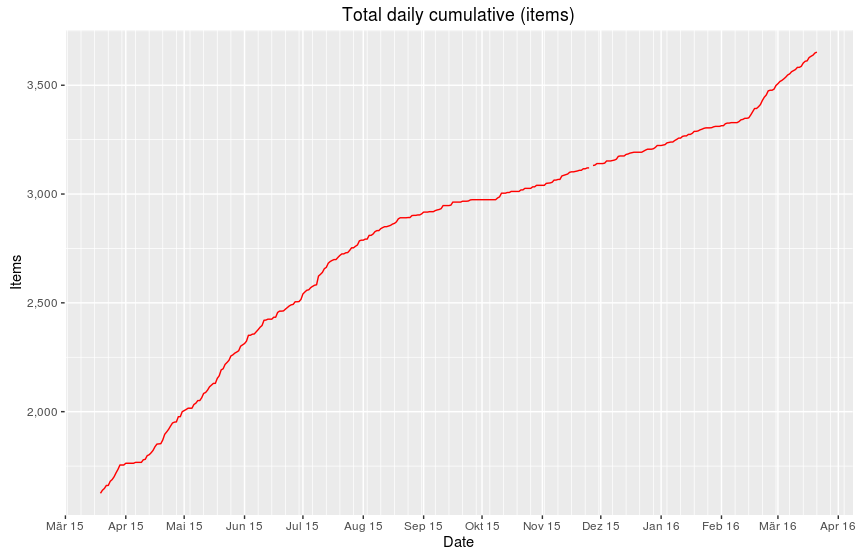
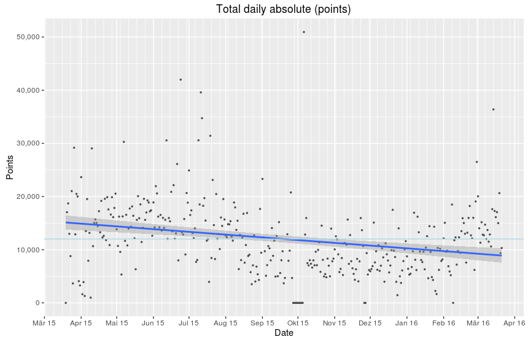
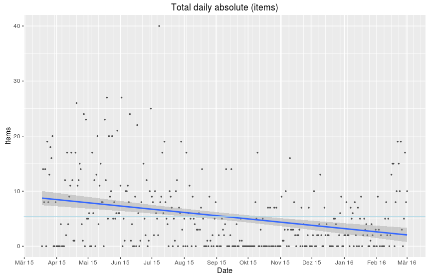
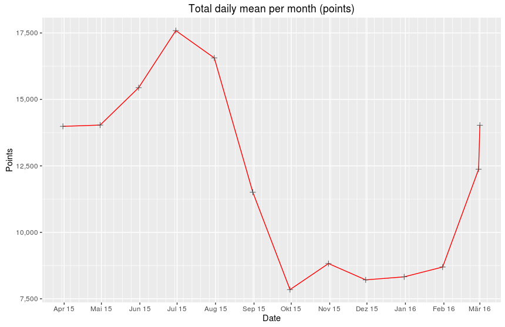
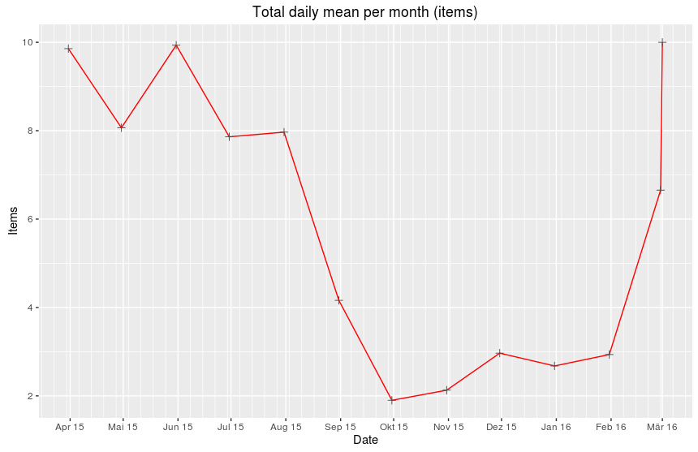
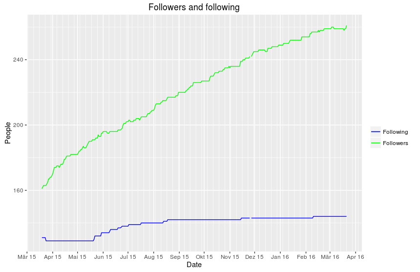

# memstats

A collection of R scripts that analyze and plot my recorded learning progress and performance with [Memrise](http://www.memrise.com). The learning data is retrieved once a day via the [unofficial API](https://github.com/carpiediem/memrise-enhancement-suite/wiki/Unofficial-Documentation-for-the-Memrise-API) and stored in a CSV file. 

##About

Since March 2015, I keep track of my Memrise learning performance (this is my [Memrise profile](http://www.memrise.com/user/mucx). Getting more diverse stats about my learning than it is displayed on one's profile page keeps me motivated and I can define new goals regularly. For example, I can decide to aim for the rise of a certain mean value, like trying to keep the overall mean of points per day on a certain level.

A cron-job controlled PHP script obtains the raw learning data from the API and stores it into a MySQL database (__Note:__ The PHP script is not part of the repository). Using the quick export function of _PHPMyAdmin_, a CSV file can be created containing the following data:

* DATE:         Date of the data retrieval
* POINTS_TOTAL: Cumulative sum of all points
* POINTS_DAY:   No longer available via the API (as of 2015-12-15)
* POINTS_MONTH: Cumulative sum of points per month
* POINTS_WEEK:  Cumulative sum of points per week
* ITEMS:        Cumulative count of learned items
* FOLLOWERS:    Number of followers
* FOLLOWING:    Number of people I follow

A variety of statistics is computed for the this data and each period subset (year, month, week) when the scripts are executed. The data is displayed in different graphs and summaries are stored as CSV files.

##TO DOs

* Time (x-axis) labels in English
* Making the plots more adaptive (axis-labels, breaks)
* More sophisticeted CSV output (combination of the CSV data that is created now)
* Enable direct access to a MySQL database (would require no CSV file)

##Examples

###Cumulative overall results

###Overall results (per day)

###Daily means per week

###Number of total followers/-ing

* * *
License: GNU GENERAL PUBLIC LICENSE