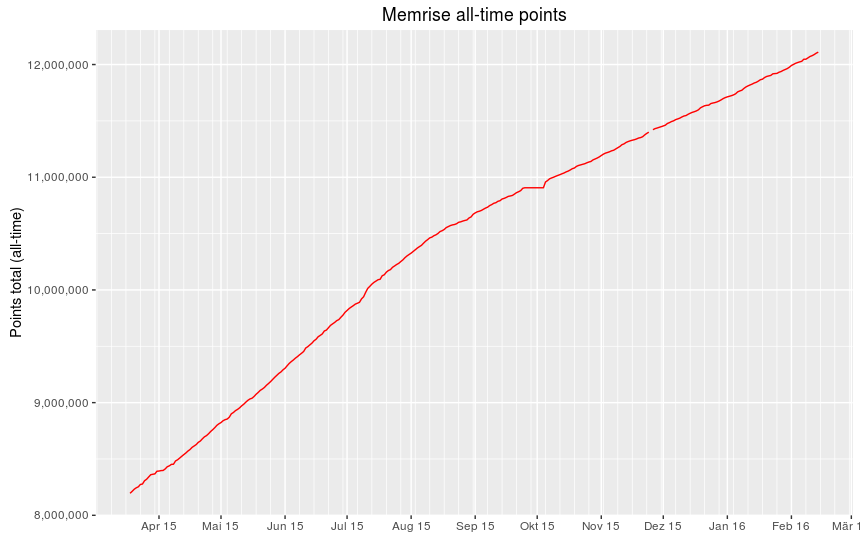

# memstats

A simple R script that analyzes and plots a user's recorded learning performance on memrise.com. The learning data is
retrieved daily via the [unofficial API](https://github.com/carpiediem/memrise-enhancement-suite/wiki/Unofficial-Documentation-for-the-Memrise-API) and stored in a CSV file. 

##About

Currently only the all-time points are plotted.

The stats are retrieved daily via a cron-job controlled PHP script and stored
in a MySQL database. Using the export function of PHPMyAdmin, a CSV file is created containing the following data:

* DATE:         Date of the data retrieval
* POINTS_TOTAL: Cumulative sum of all points
* POINTS_DAY:   No longer available via the API (as of 2015-12-15)
* POINTS_MONTH: Cumulative sum of points in one month
* POINTS_WEEK:  Cumulative sum of points in one week
* ITEMS:        Cumulative count of learned items
* FOLLOWERS:    Number of followers
* FOLLOWING:    Number of people following

##TO DOs
* Period subsets (week, month, year, total)
* Adding points/average points per period graphs
* Adding items/items average per period graphs
* Adding followers/following graph
* Allow direct access to the MySQL database (no CSV file needed anymore)
* Make plot labels English

##Examples

