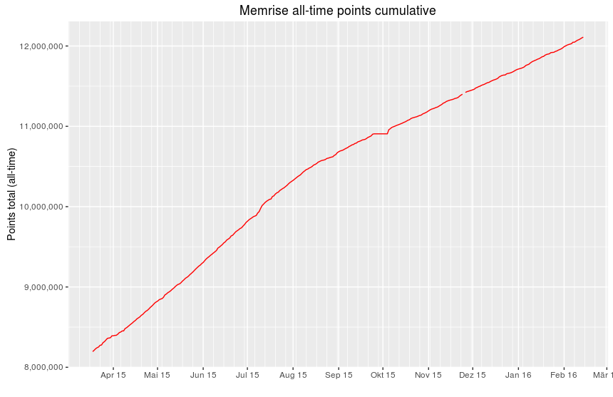
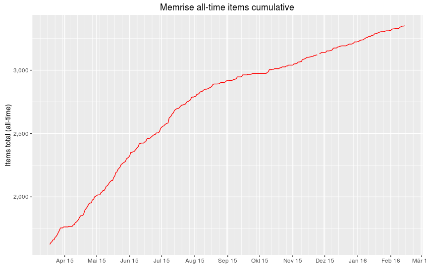

# memstats

A collection of R scripts that analyze and plot my recorded learning progress and performance with [Memrise](http://www.memrise.com). The learning data is retrieved daily via the [unofficial API](https://github.com/carpiediem/memrise-enhancement-suite/wiki/Unofficial-Documentation-for-the-Memrise-API) and stored in a CSV file. 

##About

Currently only the cumulative and absolute all-time points and items are plotted for my [Memrise profile](http://www.memrise.com/user/mucx) when the scripts are executed.

The statistical data are retrieved daily via a cron-job controlled PHP script and stored in a MySQL database (**Note:** The PHP script is not part of this repository). Using the quick export function of *PHPMyAdmin*, a CSV file is created containing the following data:

* DATE:         Date of the data retrieval
* POINTS_TOTAL: Cumulative sum of all points
* POINTS_DAY:   No longer available via the API (as of 2015-12-15)
* POINTS_MONTH: Cumulative sum of points in one month
* POINTS_WEEK:  Cumulative sum of points in one week
* ITEMS:        Cumulative count of learned items
* FOLLOWERS:    Number of followers
* FOLLOWING:    Number of people following

##TO DOs
* Period subsets (week, month, year, total)
* Adding points/average points per period graphs
* Adding items/items average per period graphs
* Adding followers/following graph
* Allow direct access to the MySQL database (would require no CSV file)
* Make time plot labels English

##Examples
Cumulative overall results

Absolute overall results (per day)

